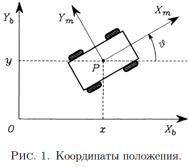
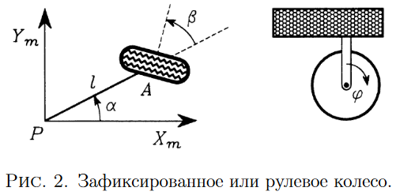
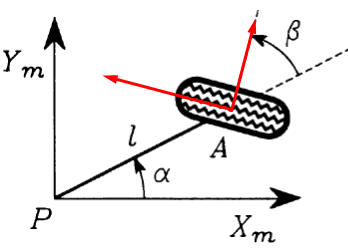
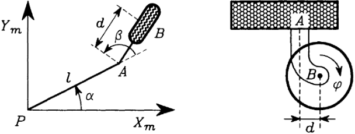
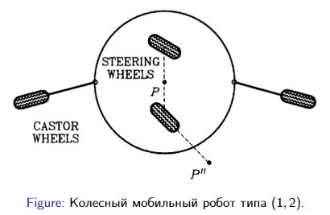

- 2 lab
- {:height 266, :width 297}
- положение робота: $\xi_b=\begin{bmatrix} x \\ y\\ \vartheta \end{bmatrix}$
- поворотная матрица: $R_b^m(\vartheta)=\begin{bmatrix} cos\vartheta & sin\vartheta & 0\\ -sin\vartheta & cos\vartheta & 0 \\ 0 & 0 & 1 \end{bmatrix}$
  $\xi_b \xmapsto{R_b^m} \xi_m$
- Обычные колеса:
	- Фиксированные колёса
		- {:height 181, :width 353}
		- $A$ - фиксирована на тележке, ее положение $l,\alpha$
		- $\beta$ ориентация плоскости колеса
		- $\varphi$ угол поворота
		- $r$ радиус колеса
		- колесо характеризуется:
		  |$l$  |$\alpha$| $\beta$  | $r$  |
		  состояние:
		  $\varphi(t)$
		- ограничения:
			- {:height 103, :width 163}
			- в плоскости колеса
				- $v_{\tau}=0$
				  $[-sin(\alpha+\beta)\,\,\, cos(\alpha+\beta)\,\,\, lcos(\beta)] R_b^m(\vartheta) \dot \xi + r\dot \varphi=0$
			- ортогональное плоскости колеса
				- $v_{n}=0$
				  $[cos(\alpha+\beta)\,\,\, sin(\alpha+\beta)\,\,\, l\, sin(\beta)]\, R_b^m(\vartheta) \dot \xi =0$
	- Рулевые колёса.
		- колесо характеризуется:
		  |$l$  |$\alpha$|   | $r$  |
		  состояние:
		  |$\varphi(t)$ | $\beta(t)$ |
		- ограничения:
			- в плоскости колеса
				- $[-sin(\alpha+\beta)\,\,\, cos(\alpha+\beta)\,\,\, lcos(\beta)] R_b^m(\vartheta)\dot \xi + r\dot \varphi=0$
			- ортогональное плоскости колеса
				- $[cos(\alpha+\beta)\,\,\, sin(\alpha+\beta)\,\,\, l\, sin(\beta)]\, R_b^m(\vartheta)\dot \xi =0$
	- роликовое (направляющее колесо)
		- {:height 158, :width 427}
		- колесо характеризуется:
		  |$l$  |$\alpha$| $r$  | $d$ |
		  состояние:
		  |$\varphi(t)$ | $\beta(t)$ |
		- ограничения:
			- в плоскости колеса
				- $[-sin(\alpha+\beta)\,\,\, cos(\alpha+\beta)\,\,\, lcos(\beta)] R_b^m(\vartheta)\dot \xi + r\dot \varphi=0$
			- ортогональное плоскости колеса
				- $[cos(\alpha+\beta)\,\,\, sin(\alpha+\beta)\,\,\, (d+l\, sin(\beta))]\, R_b^m(\vartheta)\dot \xi + d \dot \beta =0$
- степень мобильности $δ_m$ мобильного
  робота
	- $δ_m = dim(\mathcal{N} (\mathcal{C}_1^* (β_s))) = 3 − rank(\mathcal{C}_1^* (βs))$
- Конфигурационные координаты колесного мобильного
  робота
	- позиционные координаты
	  $\xi_b(t)=\begin{bmatrix} x \\ y\\ \vartheta \end{bmatrix}$
	- ориентационные координаты
	  $\beta(t)=\begin{bmatrix} \beta_s(t) \\ \beta_c(t) \end{bmatrix}$
	- вращательные координаты
- динамическая позиционная модель робота
	- {:height 223, :width 326}
	-

		- Позиционная кинематическая модель
		- Конфигурационная кинематическая модель
		- Конфигурационная динамическая модель
		- Позиционная динамическая модель
	- Описание робота
		- Положение робота
		-