- 2 lab
- 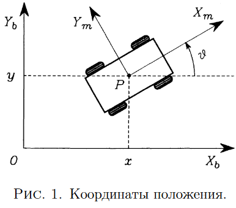{:height 266, :width 297}
- положение робота: $\xi_b=\begin{bmatrix} x \\ y\\ \vartheta \end{bmatrix}$
- поворотная матрица: $R_b^m(\vartheta)=\begin{bmatrix} cos\vartheta & sin\vartheta & 0\\ -sin\vartheta & cos\vartheta & 0 \\ 0 & 0 & 1 \end{bmatrix}$
  $\xi_b \xmapsto{R_b^m} \xi_m$
- Обычные колеса:
	- Фиксированные колёса
		- {:height 181, :width 353}
		- $A$ - фиксирована на тележке, ее положение $l,\alpha$
		- $\beta$ ориентация плоскости колеса
		- $\varphi$ угол поворота
		- $r$ радиус колеса
		- колесо характеризуется:
		  |$l$  |$\alpha$| $\beta$  | $r$  |
		  состояние:
		  $\varphi(t)$
		- ограничения:
			- {:height 103, :width 163}
			- в плоскости колеса
				- $v_{\tau}=0$
				  $[-sin(\alpha+\beta)\,\,\, cos(\alpha+\beta)\,\,\, lcos(\beta)] R_b^m(\vartheta) \dot \xi + r\dot \varphi=0$
			- ортогональное плоскости колеса
				- $v_{n}=0$
				  $[cos(\alpha+\beta)\,\,\, sin(\alpha+\beta)\,\,\, l\, sin(\beta)]\, R_b^m(\vartheta) \dot \xi =0$
	- Рулевые колёса.
	  collapsed:: true
		- колесо характеризуется:
		  |$l$  |$\alpha$|   | $r$  |
		  состояние:
		  |$\varphi(t)$ | $\beta(t)$ |
		- ограничения:
			- в плоскости колеса
				- $[-sin(\alpha+\beta)\,\,\, cos(\alpha+\beta)\,\,\, lcos(\beta)] R_b^m(\vartheta)\dot \xi + r\dot \varphi=0$
			- ортогональное плоскости колеса
				- $[cos(\alpha+\beta)\,\,\, sin(\alpha+\beta)\,\,\, l\, sin(\beta)]\, R_b^m(\vartheta)\dot \xi =0$
	- роликовое (направляющее колесо), флажковое
	  collapsed:: true
		- 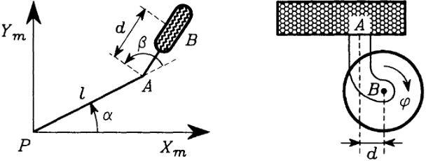{:height 158, :width 427}
		- колесо характеризуется:
		  |$l$  |$\alpha$| $r$  | $d$ |
		  состояние:
		  |$\varphi(t)$ | $\beta(t)$ |
		- ограничения:
			- в плоскости колеса
				- $[-sin(\alpha+\beta)\,\,\, cos(\alpha+\beta)\,\,\, lcos(\beta)] R_b^m(\vartheta)\dot \xi + r\dot \varphi=0$
			- ортогональное плоскости колеса
				- $[cos(\alpha+\beta)\,\,\, sin(\alpha+\beta)\,\,\, (d+l\, sin(\beta))]\, R_b^m(\vartheta)\dot \xi + d \dot \beta =0$
- Ограничения на мобильность робота
  collapsed:: true
	- f для фиксированных колёс, s для рулевых колёс, c для направляющих колёс и sw для шведских колёс.
	- _Конфигурационные координаты_ колесного мобильного
	  collapsed:: true
	  робота
		- позиционные координаты
		  $\xi_b(t)=\begin{bmatrix} x \\ y\\ \vartheta \end{bmatrix}$
		- ориентационные координаты
		  $\beta(t)=\begin{bmatrix} \beta_s(t) \\ \beta_c(t) \end{bmatrix}$
			- характеризующие ориентацию рулевых и направляющих колёс соответственно
		- вращательные координаты
		  $\varphi(t)=\begin{bmatrix} \varphi_f(t) \\ \varphi_s(t) \\ \varphi_c(t) \\ \varphi_{sw}(t) \end{bmatrix}$
			- характеризующие вращение колёс вокруг своих горизонтальных осей
	- Очевидно, что общее число конфигурационных координат равно $N_f + 2N_s + 2N_c + N_{sw} + 3$
	- Обобщенная матричная запись ограничений для всех типов колес
	  collapsed:: true
		- {:height 128, :width 306}
		- {:height 148, :width 239}
		- {:height 112, :width 401}
		-
	- Рассмотрим теперь первые $(N_f +N_s)$ нескользящих ограничений
	  collapsed:: true
		- {:height 259, :width 285}
		- ℵ - ([aleph](https://en.wikipedia.org/wiki/Aleph)): With an [ordinal](https://en.wikipedia.org/wiki/Ordinal_number) *i* as a subscript, denotes the *i*th [aleph number](https://en.wikipedia.org/wiki/Aleph_number), that is the *i*th infinite [cardinal](https://en.wikipedia.org/wiki/Cardinal_number). For example, ℵ is the smallest infinite cardinal, that is, the cardinal of the natural numbers.
			- кардинал
				- In [mathematics](https://en.wikipedia.org/wiki/Mathematics), a **cardinal number**, or **cardinal** for short, is what is commonly called the number of elements of a [set](https://en.wikipedia.org/wiki/Set_(mathematics)).
				- In the case of a finite set, its cardinal number, or cardinality is therefore a natural number.
			- *Инволютивные* распределения
				- span(col())
					- пространство натянутое на векторы
				- распределение $\Delta_c$
					- https://en.wikipedia.org/wiki/Distribution_(differential_geometry)
				- 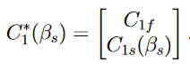
				- 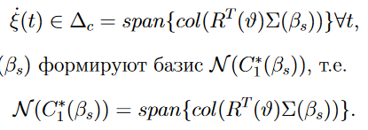
				-
		- степень мобильности $δ_m$ мобильного робота
			- $δ_m = dim(\mathcal{N} (\mathcal{C}_1^* (β_s))) = 3 − rank(\mathcal{C}_1^* (β_s))$
			- Ранг матрицы — **наивысший из порядков всевозможных ненулевых миноров этой матрицы**.
			- Если $rank(C_1^*) = 3$, то $R(ϑ) \dot ξ = 0$ и любое движение на плоскости невозможно.
		- число степенью управляемости
			- {:height 39, :width 188}
			-
	- 
	- Если мобильный робот оснащён более чем $δ_s$ рулевыми колёсами $(N_s > δ_s)$, движение дополнительных колёс должно быть скоординировано, чтобы гарантировать
	  наличие МЦВ в каждый момент времени
	- Степени мобильности и управляемости для реализуемых колёс-
	  ных мобильных роботов.
	  |$\delta_m$|3|2|2|1|1|
	  |$\delta_s$|0|0|1|1|2|
- 
	- {:height 409, :width 640}
- модели вход-состояние-выход
	- Позиционная кинематическая модель
	- Конфигурационная кинематическая модель
	- Конфигурационная динамическая модель
	- Позиционная динамическая модель
- Кинематическая модель положения
	- общие кинематические модели положения
		- Робот типа (1,2)
			- 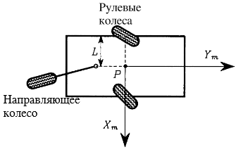
			-
			- {:height 96, :width 226}
			- {:height 51, :width 184}
			- {:height 228, :width 548}
		- кинематическую модель положения мобильного робота в компактной форме:
			- 
			- 
			- Эта кинематическая модель позволяет нам далее обсудить маневренность колесных
			  мобильных роботов.
	- неприводимости кинематической модели пространства состояний
		- каждая кинематическая модель положения неприводима.
	- Управляемость и стабилизируемость.
		- есть
- Определим степень маневренности как
	- $\delta_M=\delta_m+\delta_s$
	- почему сумма всегда равна 3? #question
- Конфигурационная кинематическая модель
  collapsed:: true
	- 
	- 
	- 
	- 
	- 
	- конфигурационной кинематической моделью
		-                    (20)
		- 
- конфигурационная динамическая модель
	- 
	- 
	- 
	-
- Конфигурации исполнительных механизмов
  collapsed:: true
	- нужно сразу договориться, что здесь $B$ это совсем не $B(z)$ из предыдущего пункта
	- два исполнительных механизма требуются для ориентации двух рулевых колёс.
	- необходимо использовать два дополнительных исполнительных механизма, к примеру,
	  для вращения колёс 1 и 2
	- $B(\beta_s,\beta_c)=[D(\beta_c)\,\,\,E(\beta_s,\beta_c)]\Sigma(\beta_s)$
	-
	- 
	- 
	- 
	- 
	- 
	- 
	-
- динамическая позиционная модель робота
	- {:height 223, :width 326}
	- Дано:
	  | Variant | Robot type | $\xi_0^T=[x_0\,\,\, y_0\,\,\, \vartheta_0]^T$ | $R_1$ | $\delta$ | Direction 1 | $\alpha$ | $t$ | $R_2$ | Direction 3 |
	  | 5 | (1,2) | $[0\,\,\, 3\,\,\,\frac{2\pi}{3}]^T$ | 7 | $2\pi$ | positive | $\frac{\pi}{3}$ | 6 |12 |clockwise |
	- модель
		- 
		- применяем ОС и получаем упрощенную систему:
		  collapsed:: true
		  $$\tau_0=F^{\dagger}(\beta) (H(\beta)\dot u - f(\beta,u))$$
		  где $F^{\dagger}$ левая инверсия $F(\beta)$
			- 
		- потом мы можем преднамеренно игнорировать координаты $β_c$ и $\varphi$ и ограничивать наше внимание следующей динамической моделью положения:
			- мы можем это сделать так как для решении задачи управления нам не важны положение колес и углы направляющих колес. Если бы это имело значение, то мы просто могли бы взять $S(q)$
			- Позиционная динамическая модель:
			  $$\dot z = B(z) u $$
			  $$\dot u = v$$
			  где $z = \begin{bmatrix} \xi \\ \beta_s \end{bmatrix}$, и $u=\begin{bmatrix} \eta \\ \zeta \end{bmatrix}$, и $v=\begin{bmatrix} v_1 \\ v_2 \end{bmatrix}$,  $B(z)=\begin{bmatrix} R^T(\vartheta)\Sigma(\beta_s) & 0 \\ 0 & I \end{bmatrix}$
				- $\Sigma = \begin{bmatrix} cos(\beta_{s1}) & cos(\beta_{s2}) \\ \delta_1(\eta_2sin(\beta_{s2})-\eta_1sin(\beta_{s1}))sin(\beta_{s1}) & \delta_1(\eta_1sin(\beta_{s1})-\eta_2sin(\beta_{s2}))sin(\beta_{s2}) \\ sin(\beta_{s1}) & -sin(\beta_{s2})  \end{bmatrix}$
					- if $v>\pi$ or $v<-\pi$:
					       $v=v-sign(v)2\pi$
					- $\beta_s\in(0,\pi)$
					- что означает $\Sigma$
						- преобразование с управляющего сигнала
				- 
				- 
				- моментное управление
				-
- Задача слежения за точкой
	- статическая обратная связь
	  collapsed:: true
		- Полярные координаты точки P′ в подвижном базисе обозначаются как (e, δ). Декартовы координаты точки P′
			- 
			- 
			- Задача слежения за точкой состоит в отыскании такого закона управления через обратную связь по состоянию, который бы обеспечивал стабильное слежение за заданными опорными координатами $x^′_r(t)$ и $y^′_r (t)$, которые предполагаются дважды дифференцируемыми.
		- новая система
		   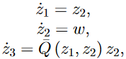
			- $z_1=h(\xi,\beta_s)$
			- для чего нам новая дин. модель? у нас же есть условна модель реального робота и мы ищем для нее управление.  #question
			- 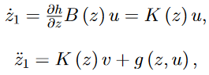
				- Cуществует линеаризующая вектор-функция выходов
					- 
						- $z_1$ это по факту координаты точки $P^{'}$ или $P^{''}$
					- 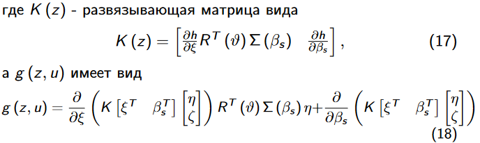{:height 121, :width 634}
					- $\large g(z,u)=\cfrac{\partial}{\partial \xi}\left(K(z)\begin{bmatrix}\eta \\ \zeta\end{bmatrix}\right) R^T(\vartheta)\Sigma(\beta_s)\eta+\cfrac{\partial}{\partial \beta_s}\left(K(z)\begin{bmatrix}\eta \\ \zeta\end{bmatrix}\right)\begin{bmatrix}\zeta_1 \\ \zeta_2\end{bmatrix}$
		- Определим преобразование координат в виде
			- 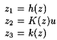
			- 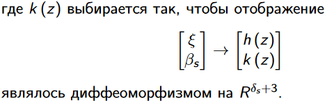
			- 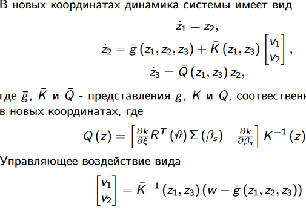
			- 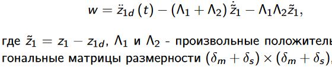
		- функции
			- 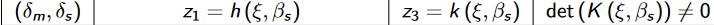
			  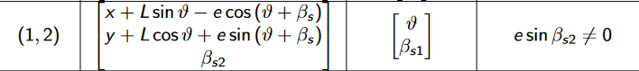
				- почему $\beta_{s2}\neq 0$
					- потому что Kinv тогда будет с элементами бесконечность
					- 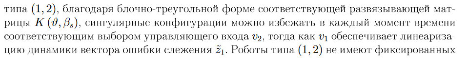
						- как это реализовать на практике? сложно, но можно
				- почему $z_3 = [,\beta_{s1}]$
			- $z_1=h(\xi,\beta_s)=\begin{bmatrix} x+Lsin(\vartheta)-e\,cos(\vartheta+\beta_{s1}) \\ y+Lcos(\vartheta)+e\,sin(\vartheta+\beta_{s1}) \\ \beta_{s2} \end{bmatrix}$ #error
				- $\beta_{s1}\in(0,\pi)$, а $\beta_{s2}$ не изменяется, он константный
				- $s1$ внизу
				-
	- динамическая ОС
		- Алгоритм динамического расширения
			- dynamical system
			  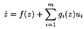
			  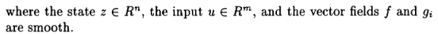
			- dynamic feedback laws
			  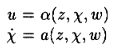
			- linearizing output functions
			  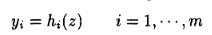
			- We apply the so-called dynamic extension algorithm to system
				- 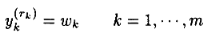
				- 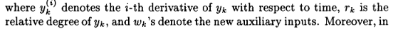
			- 
			- 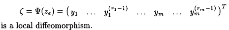
			- 
				- $w_1$ чему равно? #question
					- 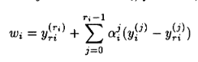
					- ка это считать?
						- {:height 146, :width 392}
						-